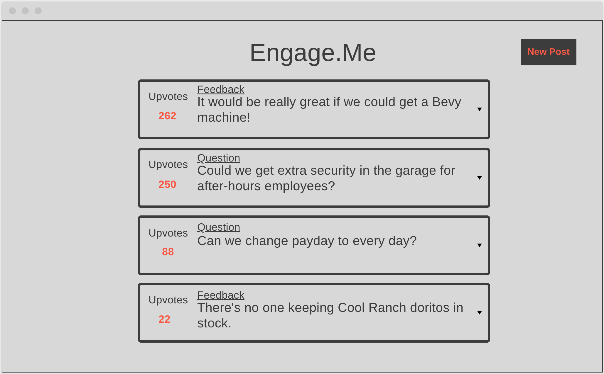
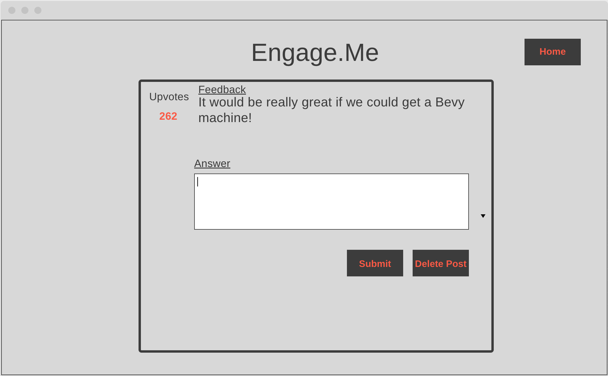
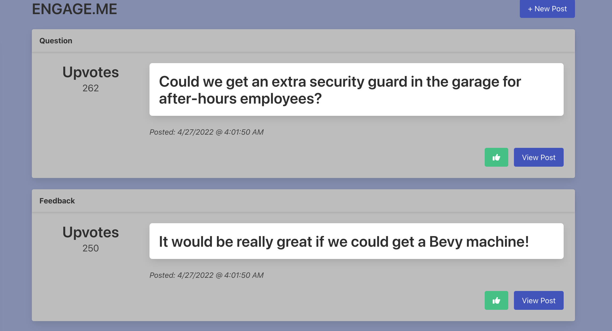
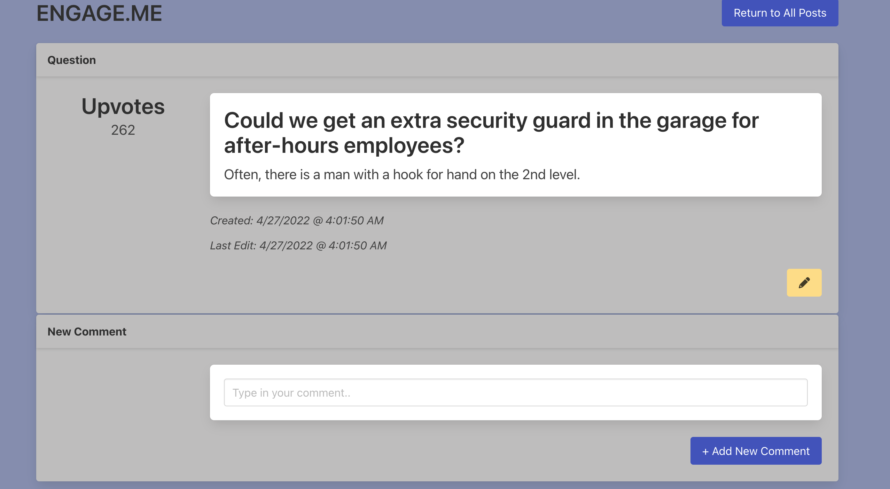

# Engage.Me
---

[Open the App!](https://bb-engage-me.herokuapp.com/)

Companies use various methods to collect ongoing feedback from their employees in various capacities and timeframes. 

By the time feedback is actioned, depending on what it is, everyone involved may even forget when and where it came from.

Introducing: Engage.Me

This app allows your employees to leave anonymous feedback or pose questions in a public format without fear of retaliation - and receive a response from a member of leadership or ELT, based on the scope of the feedback or question. 

This allows companies to quickly action feedback and, most importantly, demonstrates they are actively reading the feedback or questions.

---
### Project Mockup




---
### Live Site




---
### Routes

| Name | Method | Endpoint | Description |
| ----- | ------- | ------- | ----------- |
| Index | GET | /posts | Displays a list of all active posts
| New | GET | /posts/new | Displays a form to create a new post
| Create | POST | /posts | Adds a new post to the database and redirects to index
| Show | GET | /posts/:id | Displays a single post with comments/answers
| Edit | GET | /posts/:id/edit | Displays a form to edit the existing post
| Update | PUT | /posts/:id | Updates the post with Edit form data and redirects to index
| Destroy | DELETE | /posts/:id | Deletes the selected post and redirects to the index

---
### Models
- Post.js
    - Post Schema
    ```
    {
        feedbackType: { type: String, required: true },
        title: { type: String, required: true },
        description: { type: String, required: true },
        upVotes: Number,
        comments: [{ type: String }]
    }
    ```
---
### Libraries Used
- Express
- EJS
- Method-Override
- Mongoose
- Bulma
---
### Timeline
| Day | Goal |
|----|-----|
|Day 1 | Complete project plan, develop routes |
|Day 2 | Create models, schemas, seed data, and template pages|
|Day 3 | Finish MVP functionality and style |
